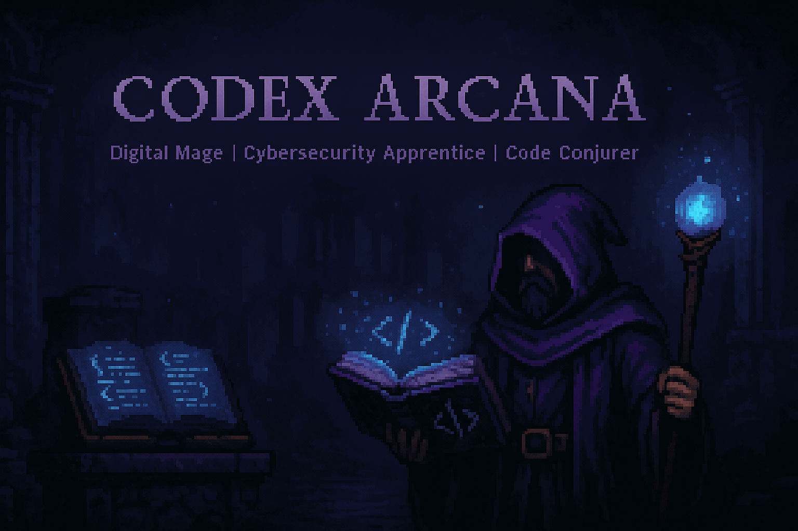

<p align="center">
  
</p>

<p align="center">
  
</p>

<p align="center">
  
  
  
</p>

<h1 align="center">🪄 Codex Arcana</h1>
<p align="center">
  <em>Writing code with intent. Testing spells with precision. Pushing the boundaries of digital sorcery.</em>
</p>

---

## 🧙 About Me


> *"Magic is just tech no one's documented yet."*

```rust
fn main() {
    let passions = vec!["Rust 🦀", "Python 🐍", "Security 🔐"];
    let mission = "Building tools that make developers' lives easier";
    
    loop {
        code();
        learn();
        share();
    }
}
```

- 🧠 Developer conjuring tools in **Rust** and **Python**  
- ⚔️ Focused on automation, terminal UX, and security workflows  
- 🔍 Projects that balance style, speed, and sorcery  
- 📚 Obsessed with GitHub Actions, clean code, and hacking gear  
- 🌱 Currently diving deeper into **systems programming** and **offensive security**
- ⚡ Fun fact: I automate everything I do more than twice

---

## 🛠️ Featured Projects

<details open>
<summary><b>🔥 Active Projects</b></summary>
<br>

<a href="https://github.com/Nullgrimoire/TSMngr">
  
</a>

**TSMngr** - Cross-platform ticket system manager
- 🧾 Built with Python and SQLite
- 🖥️ Beautiful CLI interface with rich formatting
- ⚡ Fast, lightweight, and easy to use

<br>

<a href="https://github.com/Nullgrimoire/NullScan">
  
</a>

**NullScan** - Blazing fast network scanner
- 🦀 Written in Rust for maximum performance
- 🔍 CIDR support and intelligent concurrency
- 🎯 Perfect for security audits and network discovery

</details>  

---

## ⚙️ Tech Stack & Tools

<p align="center">
  
</p>

### 💻 Languages


### 🛠️ Tools & Frameworks


### 🔐 Security Tools


---

## 📊 GitHub Analytics

<p align="center">
  
  
</p>

<p align="center">
  
</p>

<p align="center">
  
</p>

<details>
<summary><b>🏆 GitHub Trophies</b></summary>
<br>
<p align="center">
  
</p>
</details>

---

## 📫 Let's Connect

<p align="center">
  <a href="https://nullgrimoire.github.io/DigitalGrimoire/">
    
  </a>
  <a href="mailto:null.grimoire.mage@gmail.com">
    
  </a>
  <a href="https://buymeacoffee.com/nullgrimoire">
    
  </a>
</p>

<p align="center">
  
</p>

---

<p align="center">
  <i>"Commit spells. Push dreams. Merge realities."</i>
  <br><br>
  
</p>
